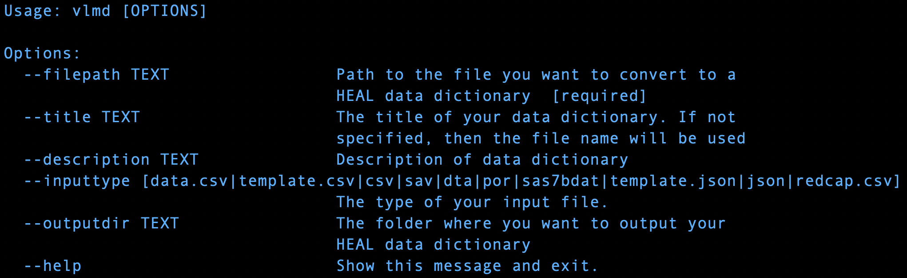

# Generate a HEAL-compliant Data Dictionary (Beta Testing)

!!! info
     The following instructions are for those with less familiarity with the CLI and virtual environments. If you are already proficient in setting up virtual environments, we recommend that you follow your usual protocol, please jump ahead to the [installation instructions](#2-install-the-heal-data-utilities). 

---

## 0. Getting Started 

The HEAL Data Utilities is a software package that can be leveraged via a **command-line interface**. The following instructions will walk you through the process of installing Python, setting up a virtual environment, installing HEAL Data Utilities and using the tool to create a HEAL-compliant data dictionary. If you already have Python installed and experience with  setting up a virtual environment, you can skip to  [Step 2. Install the HEAL Data Utilities](#2-install-the-heal-data-utilities).

### The Command-line Interface (CLI)

To get started, you will need to navigate to your computer’s **command-line interface**, or CLI. On macOS, this is known as **Terminal**, and can be opened by pressing Command + Space Bar on your Mac keyboard and searching for “Terminal.” For Windows and PC users, your command-line interface may be **PowerShell** or **Command Prompt**, which can be opened by clicking the Search bar/icon in your Taskbar and searching for “Powershell” or “cmd.”. 

### Python

The HEAL Data Utilities is built on Python, a widely used programming language that may   already be installed on your computer.

While the HEAL Data Utilities should be compatible with most versions of Python, you can download the latest version of Python [here](https://www.python.org/downloads/) and install it on your local computer. We recommend installing Python version 3.10 or higher. 

Once you have opened the command-line interface and installed Python, you can now begin following the steps outlined below. 

## 1. Set Up a Virtual Environment

We highly recommend installing the HEAL Data Utilities in a virtual environment, since there are several software dependencies that will be installed along with `healdata-utils`. A virtual environment will allow you to successfully install these packages without affecting other software already installed on your computer. The following steps will walk you through this process. You can learn more about creating virtual environments with Python [here](https://docs.python.org/3/library/venv.html).  

### Create a Project Folder

- `mkdir my_project/`

- `cd my_project `

These two lines make a directory, or folder, named my_project. That folder is then set as the current working directory; this folder will become the virtual environment. 

### Export Your Study’s Dataset or Data Dictionary

There are many applications and software packages that are commonly used during the data collection and processing phases of studies. The HEAL Data Utilities accommodates ten different input file formats, which include:

     1. data.csv
     2. template.csv
     3. csv
     4. sav
     5. dta
     6. por
     7. sas7bdat
     8. template.json
     9. json
     10. redcap.csv 

Export your study’s dataset or data dictionary into the `my_project/` folder. If you would like more information on supported file formats, please see our section on [supported input formats](resources/supported_input_formats.md). 

### Create Virtual Environment

- `python -m venv myenv –upgrade-deps`

This line is calling the module `-m` in Python for virtual environments `venv` and naming it `myenv`. 

### Activate Virtual Environment

#### MacOS and Linux

`source venv/bin/activate`

#### Windows and PC

`venv\Scripts\activate.bat`

If you would like to deactivate your virtual environment at any time, use the command `deactivate`.

## 2. Install the HEAL Data Utilities 

Now that you’ve created and activated your virtual environment and saved your study’s dataset or data dictionary into the `my_project/input/` folder in the virtual environment, you’re ready to install the HEAL Data Utilities in the virtual environment. 

`pip install healdata-utils --pre`

Next, to check that the HEAL Data Utilities package was installed in the virtual environment rather than your local computer, do the following:

`which vlmd`

The installation path should look like something like this:

`/Users/my_username/path_to_project_folder/my_project/venv/bin/vlmd`

## 3. Generate a HEAL Data Dictionary 

Now that the HEAL Data Utilities python package has been successfully installed, it can be used to generate a HEAL-compliant data dictionary. The command `vlmd` will be used to call the `healdata-utils` Python package. 

To confirm installation and to see the different command options:

`vlmd --help`

Note that the only required flag is `--filepath`, the path to the file you want to convert to a HEAL-compliant data dictionary. 

If you do not enter a `--description`, the tool will successfully generate a HEAL-compliant data dictionary, but it will produce the following error for the JSON format: 

`JSON data dictionary not valid, see heal-json-errors.json`

Please note you will have the opportunity to provide a description when you submit the data dictionary to the Platform. 

---

Here is how you would generate a HEAL Data Dictionary with a data dictionary downloaded from RedCap:

#### MacOS and Linux

Execute the following command: 

`vlmd --filepath ./input/example_redcap_demo.redcap.csv --inputtype redcap.csv --outputdir ./output/heal-vlmd-from-redcap.csv`

#### Windows and PC

Execute the following command: 

`vlmd --filepath .\input\example_redcap_demo.redcap.csv --inputtype redcap.csv --outputdir .\output\heal-vlmd-from-redcap.csv`

---

In this command, `example_repcap_demo.redcap.csv` is the filename of the data dictionary that was exported from RedCap, `redcap.csv` is the file format, and `heal-vlmd-from-redcap.csv` is the filename chosen for the newly created HEAL-compliant data dictionary.

Once this command executes, the generated HEAL-compliant data dictionary will be saved in the `output/` folder along with error logs. 

---

## Summary of Command Line Prompts

The following is a collection of prompts used in the above instructions. 

1. `mkdir my_project`
2. `cd my_project`
3. `python -m venv venv`
4. Activate your virtual environment with `source venv/bin/activate` for macOS and Linux or `venv\Scripts\activate.bat` for Windows and PC
5. `mkdir input`
6. `mkdir output`
7. Download Your Dataset or Data Dictionary into the `my_project/input/` folder
8. `pip install healdata-utils`
9. `vlmd --help`
10. `vlmd --filepath ./input/example_redcap_demo.redcap.csv --inputtype redcap.csv --outputdir ./output/heal-vlmd-from-redcap.csv`
