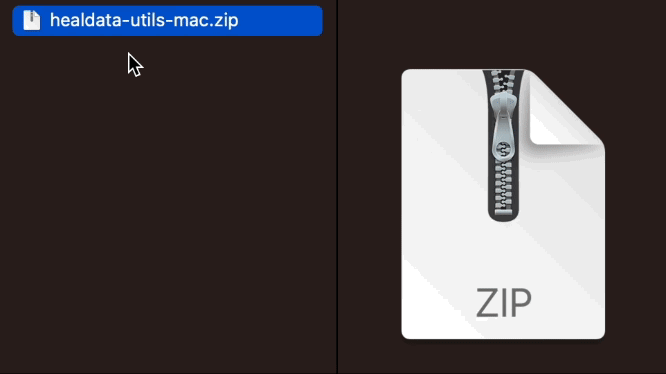

# Generate a HEAL-compliant Data Dictionary (Beta Testing)

!!! info

    The following instructions will walk you through the process of downloading a stand-alone executable version of the VLMD Tool. This is recommended for users with less familiarity with the CLI, who want a more streamlined approach to generate HEAL-compliant data dictionaries. If you would like to install and integrate the VLMD Tool into an existing local pipeline, please check out the HEAL Data Utilities on [GitHub](https://github.com/heal/healdata-utils) or [PyPi](https://pypi.org/project/healdata-utils/) for more information.

The HEAL Data Utilities is a tool developed in order to help investigators generate HEAL-compliant variable-level metadata (VLMD), in the form of standardized data dictionaries. This VLMD Tool is a software package that can be leveraged via a command-line interface (CLI) and HEAL Workspaces, and it can also be incorporated into existing pipelines. 

There are many applications and software packages that are commonly used during the data collection and processing phases of studies. The HEAL Data Utilities accommodates several different input file formats. Please follow the links below if you would like to learn more:

- [CSV datasets](https://heal.github.io/healdata-utils/vlmd/extract/csvdata)
- [CSV (minimal) data dictionary](https://heal.github.io/healdata-utils/vlmd/extract/csvdd)
- [SPSS datasets](https://heal.github.io/healdata-utils/vlmd/extract/spss)
- [SAS datasets](https://heal.github.io/healdata-utils/vlmd/extract/sas)
- [Stata datasets](https://heal.github.io/healdata-utils/vlmd/extract/stata)
- [REDCap data dictionary](https://heal.github.io/healdata-utils/vlmd/extract/redcapcsv)
- [Frictionless Table Schema](https://heal.github.io/healdata-utils/vlmd/extract/frictionlessschema)
- [Excel dataset](https://heal.github.io/healdata-utils/vlmd/extract/exceldata)

---

## Using the Stand-alone VLMD Tool

In an effort to further streamline the data dictionary extraction process for researchers, we have developed a stand-alone executable version of the VLMD Tool. 

!!! info "Download the VLMD Tool"
   
    You can download the latest version of the VLMD Tool for your operating system (i.e., MacOS, Windows, Linux) from the NIH HEAL Initiative’s GitHub repository:

    <p align="center">[Download Latest Software Release](https://github.com/HEAL/healdata-utils/releases/latest){ .md-button }</p>

Once you have downloaded the zip file, double-click the file to uncompress the package. You should then see a file labeled `vlmd` or `vlmd.exe`, depending on your operating system.



Double-clicking `vlmd` will open your computer's command-line interface. On macOS, this is the application **Terminal**. For Windows and PC users, your command-line interface may be **PowerShell** or **Command Prompt**.  Once the interface opens and the Tool is loaded, you will be greeted with four options: documentation, extract, start, and validate. 


### Executable Commands

#### extract  
Extract the variable level metadata from an existing file with a specific type/format

#### start  
Start a data dictionary from an empty template

#### validate  
Check (validate) an existing HEAL Data Dictionary file to see if it follows the HEAL specifications after filling out a template or further annotation after extracting from a different format.

!!! info

    Typing the `documentation` command will launch the VLMD Data Dictionary definitions in the [HEAL Data Utilities documentation](https://heal.github.io/healdata-utils/vlmd/#csv-and-json-data-dictionary-definitions).

---

## Using the VLMD Tool in HEAL Workspaces with Python

This tool can also be used in HEAL Workspaces, rather than downloading to your local machine. To request access to a workspace, see instructions [here](./heal_workspace_registration.md).

Once workspace access has been approved, select the (Generic) Jupyter Lab Notebook with R Kernel to get started using the VLMD Tool in [HEAL Workspaces](https://healdata.org/portal/workspace).  

{ height="500" }

After you’ve launched the workspace, you can import the necessary functions. The below commands provide examples of how to extract VLMD from an SPSS data file, create a new VLMD file from scratch, and validate an existing data dictionary in CSV and JSON formats. 

### Python Functions

#### extract
```python

from healdata_utils import convert_to_vlmd

convert_to_vlmd(input_filepath="/pd/myproject/myfile.sav",inputtype="spss")

```
#### start
```python

from healdata_utils import write_vlmd_template

write_vlmd_template(tmpdir.joinpath("heal.csv"),numfields=10)
    
```
#### validate 
```python

from healdata_utils import validate_vlmd_csv,validate_vlmd_json

validate_vlmd_csv("data/myhealcsvdd.csv")

validate_vlmd_json("data/myhealjsondd.json")

```

Please note, using the VLMD Tool in HEAL workspaces is only recommended for users who have input data dictionary, rather than their entire dataset. We do not recommend uploading your entire dataset into the secure cloud environment. 


## Output
