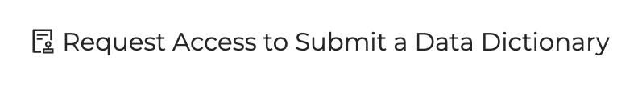
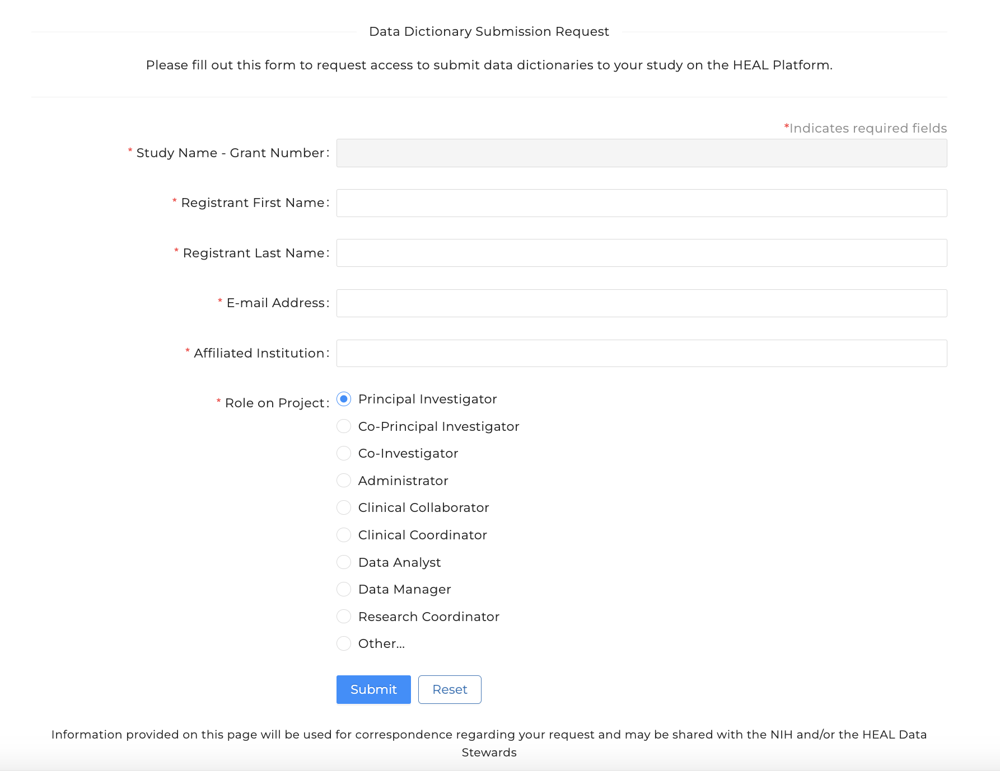

# Request Access to Submit a Data Dictionary

!!! info

     These instructions will show you how to request access to submit a data dictionary to the Platform. 

     If you were the team member to register your study, please skip to our instructions on how to submit a data dictionary to the Platform: [Submit a Data Dictionary](vlmd_submission.md)

## Step 1: Login to the HEAL Data Platform

<!-- If you want to play with sizing, you can use something like {: style="height:250px;width:534px"} -->

## Step 2: Find your study

From the [Discovery Page](https://healdata.org/portal/discovery), find the study you
wish to request access to register.

- Click on the study to open the Study Page
- At the top of the Study Page, select `Request Access to Submit a Data Dictionary`
  to navigate to the Study Registration Access Request form.

## Step 3: Complete the Data Dictionary Submission Request Form

- The field `Study Name - Grant Number` will already be filled in.
- You will need to provide your name, your email address, institutional
  affiliation and role on the project/study.

After submitting, you will receive an email indicating the status of your
request within one business day. When approved, you will then be able to
[register your study](registering-your-study.md).
